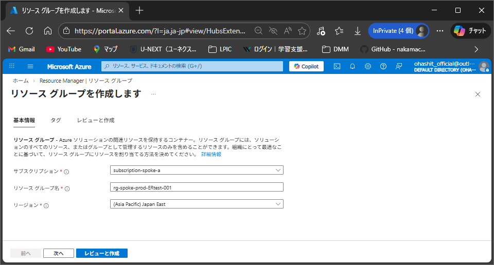
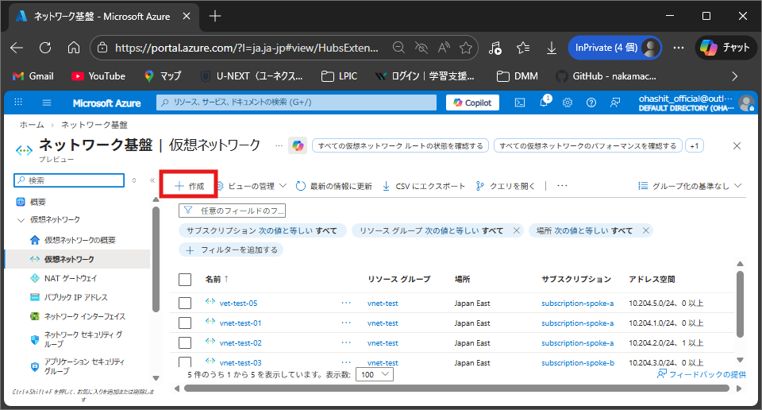
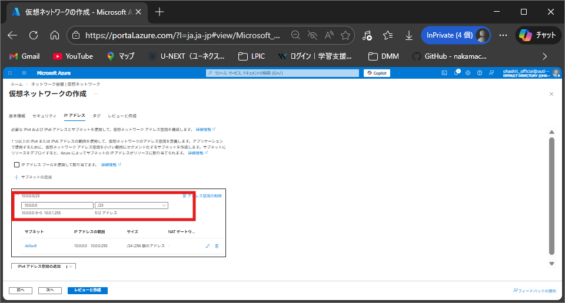
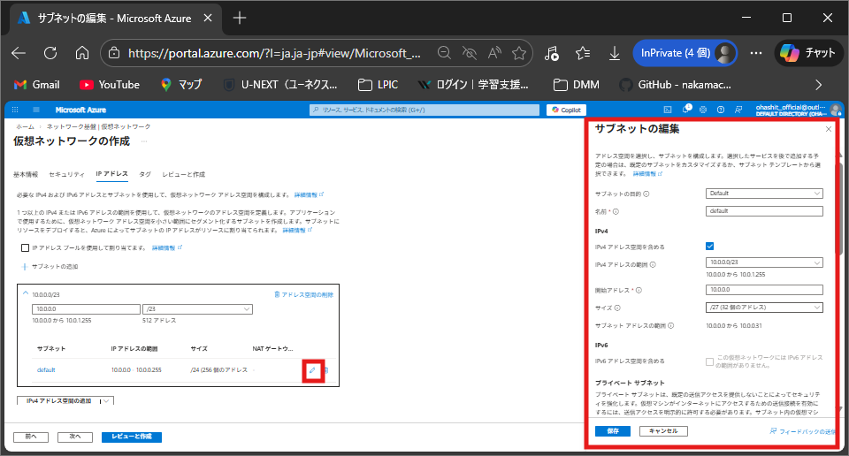

# ExpressRoute回線をデプロイするためのAzureネットワーク環境構築手順

## 概要

本手順書では、Microsoft Azure上にExpressRoute回線を接続するためのネットワーク環境を構築する手順について説明します。   

以下のリソースを順番に作成します。

- リソースグループ
- 仮想ネットワーク（Virtual Network）
  - defaultサブネット
  - GatewaySubnet（Virtual Network Gateway用サブネット）
- 仮想マシン（動作確認用 ×2台）
- ExpressRoute Gateway（Virtual Network Gateway）

 

---

## リソースグループの作成
Azure Portalから「リソース グループ」と検索し、「作成」を押下する   

   

 

サブスクリプション名、リソースグループ名、作成するリージョンを入力して作成する   

 

 

## 仮想ネットワークの作成
Azure Portalから「仮想ネットワーク」を検索し、「作成」を押下する  

 

 

先ほど作成したリソースグループを指定し、任意の仮想ネットワーク名と、リソースグループと同じリージョンを選択する 

 

 

IPアドレスタブにて、作成する仮想ネットワークのIP範囲を設定する 

 

 

必要であれば、「サブネットの追加」より、defaultサブネットのIPアドレス範囲を/27に設定する 

 

 

### Virtual Network Gatewayサブネットの追加
「サブネットの追加」→ サブネットの種類「Virtual Network Gateway」を選択し、追加する   
※IPアドレス範囲は/27を指定する   

 

 

レビューと作成タブにて、内容に問題がなければ「作成」を押下する 

 

 

## 仮想マシンの作成

下記の方法で2台作成する。 

Azure Portalで「仮想マシン」を検索し、「作成」を押下する 

 

 

### 基本タブ

| 項目 | 入力方法 |
| -- | -- |
| サブスクリプション | Spoke環境のリソースグループがあるサブスクリプション |
| リソース グループ | Spokeの仮想ネットワークがあるリソースグループ |
| 仮想マシン名 | 任意の仮想マシン名 |
| リージョン | (Asia Pacific) Japan East |
| 可用性オプション | インフラストラクチャ冗長は不要 |
| セキュリティの種類 | Standard |
| イメージ | Windows Server 2025 Datacenter: Azure Edition - x64 Gen2 |
| サイズ | デフォルト |
| ユーザー名 | 仮想マシンの管理者アカウント名 |
| パスワード | 管理者アカウントのパスワード |
| パブリック受信ポート | なし |

 

 

### ネットワークタブ

| 項目 | 入力方法 |
| -- | -- |
| 仮想ネットワーク | 作成した仮想ネットワーク |
| サブネット | default |
| パブリック IP | なし |
| NIC ネットワーク セキュリティ グループ | Basic |
| パブリック受信ポート | なし |

 

 

「確認および作成」で「作成」を押下する 

 

 

---

## 仮想マシンへBastionを使用してログイン

作成した仮想マシンをAzure Portalで開き、「接続」→「Bastion」を押下する 

 

 

作成時に入力したユーザー名とパスワードを入力して接続する 

 

 

自動的にBastionがデプロイされ、接続される 

 

 

---

## ExpressRoute Gatewayのデプロイ

Azure Portalで「Virtual network gateways」と検索し、ExpressRoute gatewayであることを確認して「作成」を押下する 

 

 

### 基本タブ

| 項目 | 入力方法 |
|:---------|:---------|
| サブスクリプション | 作成したリソースグループが存在するサブスクリプション |
| リソース グループ | 作成したネットワークが存在するリソースグループ |
| インスタンスの名前 | ExpressRouteGatewayの名前 |
| リージョン | 仮想ネットワークと同じリージョン |
| ゲートウェイの種類 | ExpressRoute |
| SKU | Standard |
| 仮想ネットワーク | 作成した仮想ネットワーク |

 

 

「確認および作成」で「作成」を押下する 

 